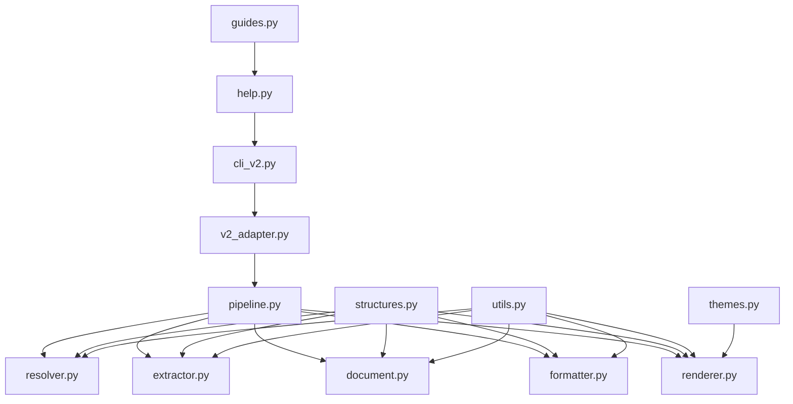

# Nanodoc Redesign File Layout

This document describes the proposed file layout for the redesigned Nanodoc
codebase.

## Source Code Structure

```text
src/nanodoc/v2/
├── __init__.py           # Package initialization
├── structures.py         # Core data structures
├── resolver.py           # Path resolution
├── extractor.py          # Content extraction
├── document.py           # Document tree construction
├── formatter.py          # Content formatting
├── renderer.py           # Output rendering
├── pipeline.py           # Pipeline orchestration
├── utils.py              # Common utilities
├── themes.py             # Theme management
├── guides.py             # Guide content management
└── help.py               # Help functionality
```

## Test Structure

```text
tests/v2/
├── __init__.py                   # Test package initialization
├── conftest.py                   # Test fixtures and utilities
├── test_structures.py            # Tests for data structures
├── test_resolver.py              # Tests for path resolution
├── test_extractor.py             # Tests for content extraction
├── test_document.py              # Tests for document construction
├── test_formatter.py             # Tests for content formatting
├── test_renderer.py              # Tests for output rendering
├── test_pipeline.py              # Tests for pipeline orchestration
├── test_utils.py                 # Tests for utilities
├── test_themes.py                # Tests for theme management
├── test_guides.py                # Tests for guide content
├── test_help.py                  # Tests for help functionality
├── test_integration.py           # Integration tests
└── test_e2e.py                   # End-to-end tests
```

## Test Fixtures

```text
tests/v2/fixtures/
├── files/                        # Regular test files
│   ├── file1.txt
│   ├── file2.txt
│   └── file3.md
├── bundles/                      # Bundle test files
│   ├── simple_bundle.txt
│   ├── nested_bundle.txt
│   └── mixed_content_bundle.txt
├── directories/                  # Directory test structures
│   ├── dir1/
│   │   ├── file1.txt
│   │   └── file2.txt
│   └── dir2/
│       ├── file3.txt
│       └── subdir/
│           └── file4.txt
└── complex/                      # Complex test cases
    ├── complex_bundle.txt
    ├── inline_bundle.txt
    └── mixed_sources.txt
```

## CLI Integration

```text
src/nanodoc/
├── cli_v2.py                     # CLI proxy for v2 implementation
└── v2_adapter.py                 # Adapter between CLI and v2 pipeline
```

## Module Dependencies

The v2 implementation will maintain a clear dependency structure:



## Implementation Notes

1. **Isolation**: The v2 implementation will be completely isolated from the
   original code, allowing for parallel development and testing.

2. **Imports**: Each module will explicitly import only what it needs, avoiding
   circular dependencies.

3. **Testing**: Each module will have corresponding test files with
   comprehensive test coverage.

4. **Documentation**: Each module will include detailed docstrings and type
   hints.

5. **CLI Agnostic**: The core v2 implementation will be CLI-agnostic, with CLI
   integration handled separately.

## Migration Strategy

1. Develop and test the v2 implementation in isolation
2. Create the CLI adapter to connect the existing CLI to the v2 pipeline
3. Add a feature flag to switch between v1 and v2 implementations
4. Once v2 is stable, make it the default implementation
5. Eventually remove the v1 implementation when appropriate
